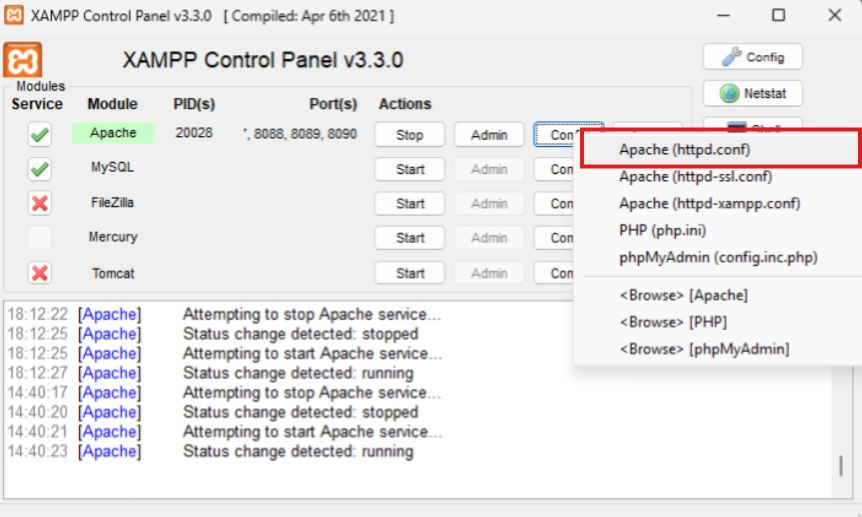
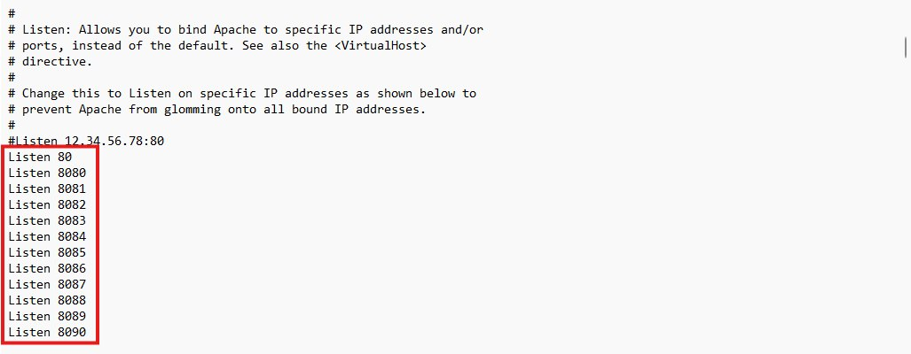
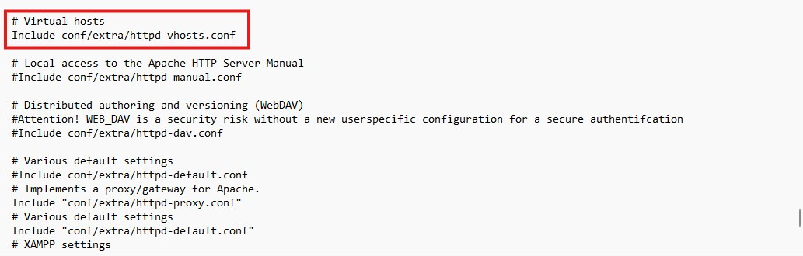
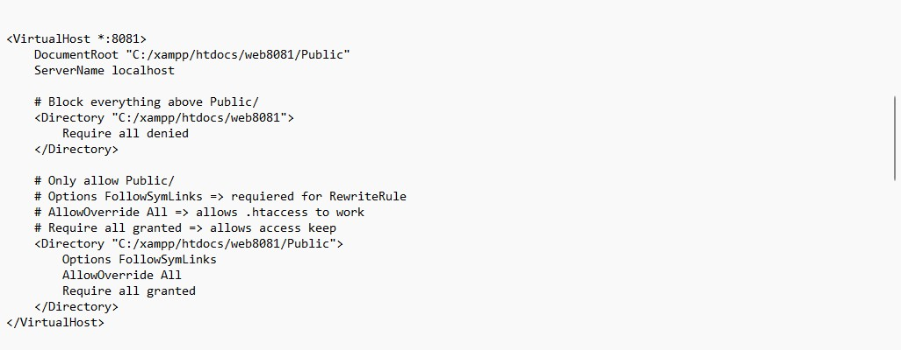
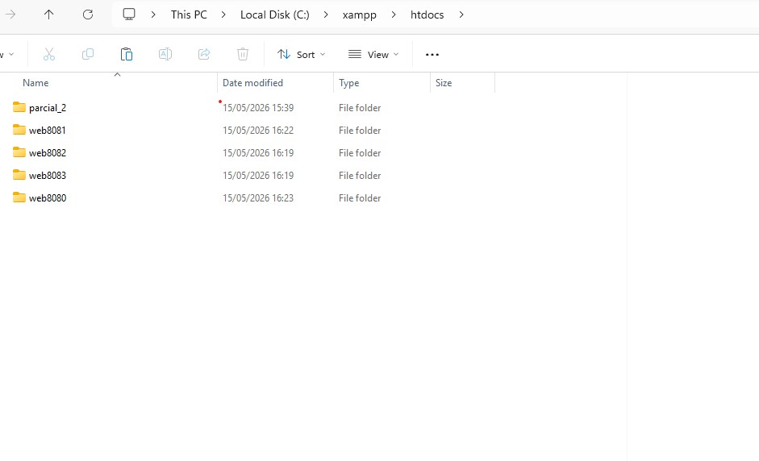
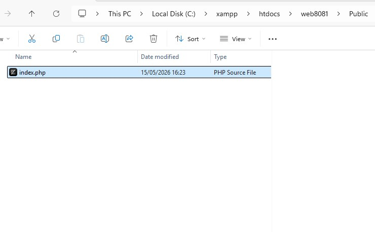
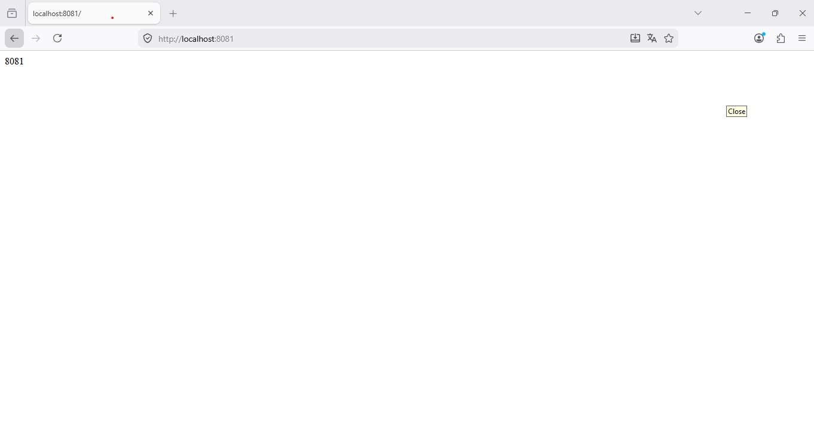

# DS7

## Xampp Config





```
C:/xampp/apache/conf/httpd.conf =>

Listen 80
Listen 8080
Listen 8081
Listen 8082
Listen 8083
Listen 8084
Listen 8085
Listen 8086
Listen 8087
Listen 8088
Listen 8089
Listen 8090
```


```
C:/xampp/apache/conf/httpd.conf =>

# Virtual hosts
Include conf/extra/httpd-vhosts.conf
```



```
C:/xampp/apache/conf/extra/httpd-vhosts.conf =>

<VirtualHost *:8080>
    DocumentRoot "C:/xampp/htdocs/web8080/Public"
    ServerName localhost

    # Block everything above Public/
    <Directory "C:/xampp/htdocs/web8080">
        Require all denied
    </Directory>

    # Only allow Public/
    # Options FollowSymLinks => requiered for RewriteRule
    # AllowOverride All => allows .htaccess to work
    # Require all granted => allows access keep
    <Directory "C:/xampp/htdocs/web8080/Public">
        Options FollowSymLinks        
        AllowOverride All            
        Require all granted          
    </Directory>
</VirtualHost>


<VirtualHost *:8081>
    DocumentRoot "C:/xampp/htdocs/web8081/Public"
    ServerName localhost

    # Block everything above Public/
    <Directory "C:/xampp/htdocs/web8081">
        Require all denied
    </Directory>

    # Only allow Public/
    # Options FollowSymLinks => requiered for RewriteRule
    # AllowOverride All => allows .htaccess to work
    # Require all granted => allows access keep
    <Directory "C:/xampp/htdocs/web8081/Public">
        Options FollowSymLinks        
        AllowOverride All            
        Require all granted          
    </Directory>
</VirtualHost>


<VirtualHost *:8082>
    DocumentRoot "C:/xampp/htdocs/web8082/Public"
    ServerName localhost

    # Block everything above Public/
    <Directory "C:/xampp/htdocs/web8082">
        Require all denied
    </Directory>

    # Only allow Public/
    # Options FollowSymLinks => requiered for RewriteRule
    # AllowOverride All => allows .htaccess to work
    # Require all granted => allows access keep
    <Directory "C:/xampp/htdocs/web8082/Public">
        Options FollowSymLinks        
        AllowOverride All            
        Require all granted          
    </Directory>
</VirtualHost>

<VirtualHost *:8083>
    DocumentRoot "C:/xampp/htdocs/web8083/Public"
    ServerName localhost

    # Block everything above Public/
    <Directory "C:/xampp/htdocs/web8083">
        Require all denied
    </Directory>

    # Only allow Public/
    # Options FollowSymLinks => requiered for RewriteRule
    # AllowOverride All => allows .htaccess to work
    # Require all granted => allows access keep
    <Directory "C:/xampp/htdocs/web8083/Public">
        Options FollowSymLinks        
        AllowOverride All            
        Require all granted          
    </Directory>
</VirtualHost>
```
### Files





### Ports



```
http://localhost:8081/
http://localhost:8082/
http://localhost:8082/
`

## Install

### Windows


**server**
```
C:\xampp\htdocs\
```


## Server

```
http://localhost:80
http://localhost/
http://localhost/public/index.php

load cache = ctrl + shift + r
```
### FreeBSD

```
pkg install 
php84
php84-opcache 
php84-mbstring
php84-composer
php84-pecl-xdebug

debug:
php84-fpm
mod_php84
```

### Composer

(getcomposer)[https://getcomposer.org]

(getcomposer download)[https://getcomposer.org/download]

(debug_backtrace)[https://www.php.net/manual/en/function.debug-backtrace.php]


## Commands

```
php --version
php --ini

<?php phpinfo() ?>
```

```
mkdir -p /usr/local/www/debug/
/usr/local/www/debug/
```

```
composer --version
composer init
```

```
mysql -u root -p < db.sql
mysql -u root -p < db.sql
mysql -u root -p -D empresa -e "SELECT * FROM usuario;"
ALTER USER 'root'@'localhost' IDENTIFIED BY 'NewPassword123!';
FLUSH PRIVILEGES;
exit


nvim ~/.my.cnf
chmod 600 ~/.my.cnf
mysql -e "SELECT 1;"

mysql < db.sql
mysql -D empresa -e "SELECT * FROM usuario;"

```

## Makefile
```
make debug input="parcial_1"
```

## Glosario

```
https://www.w3schools.com/PHP/func_misc_exit.asp
https://www.w3schools.com/PHP/func_misc_die.asp
https://docs.php.earth/faq/misc/structure/
https://stackoverflow.com/questions/41209349/requirevendor-autoload-php-failed-to-open-stream
`````
